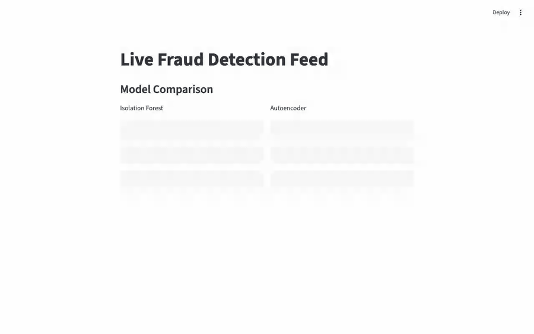

# Fraud Detection API


A real-time fraud detection demo inspired by tools like Stripe Radar: two
anomaly-detection models trained on real transaction data, replayed through a
Redis Streams pipeline as if they were arriving live, scored in real time, and
visualized in a Streamlit dashboard as they come in.



## What this is

This project answers a simple question: *if you had to flag suspicious
transactions in real time, what would the smallest end-to-end version of that
look like?* It's a learning/portfolio project, not a production system — see
[Non-goals](#non-goals) for what's deliberately left out and why.

It's built in two halves:

- **Offline**: train two different anomaly-detection models on the
  [Kaggle Credit Card Fraud dataset](https://www.kaggle.com/datasets/mlg-ulb/creditcardfraud)
  (284,807 real, anonymized transactions, ~0.17% fraud) and compare how they
  do.
- **Online**: replay transactions the models never saw during training
  through a streaming pipeline, score each one the moment it arrives, and
  watch the results live.

## Architecture

Five pieces, each with one job:

| Component | File | Job |
|---|---|---|
| Trainer | `train.py` | Loads the dataset, splits it chronologically, trains both models, evaluates them, saves everything to `models/` |
| Producer | `replay_producer.py` | Replays held-out (never-trained-on) transactions into a Redis Stream, one at a time, with a configurable delay |
| Scorer | `scorer_service.py` | Consumes the stream, scores each transaction with both models, publishes the combined result to a Redis pub/sub channel |
| API | `api.py` (FastAPI) | `POST /score` for one-off scoring, `GET /models` for the trained models' metrics, `WS /stream` to forward the live scored feed |
| Dashboard | `dashboard.py` (Streamlit) | Connects to the websocket, renders a live rolling table with the models' comparison stats up top |

**Offline, once:**
```
Kaggle CSV ──► train.py (chronological split, fit on legit-only train rows)
                  │
                  ▼
      models/*.joblib, metrics.json, test_holdout.csv (never seen in training)
```

**Online, the live demo:**
```
test_holdout.csv ─► replay_producer.py ─► Redis Stream "transactions"
                                                    │
                                                    ▼
                                          scorer_service.py
                                     (loads models/*.joblib, scores)
                                                    │
                                                    ▼
                                Redis pub/sub "scored_transactions"
                                                    │
                                                    ▼
                                  api.py — WS /stream (FastAPI)
                                                    │
                                                    ▼
                                    dashboard.py (Streamlit)
```

Redis Streams stands in for Kafka — same producer/consumer/broker shape
(consumer groups, at-least-once delivery), without the operational overhead
of running a real Kafka broker for a demo.

## The models

Both models are unsupervised anomaly detectors: they learn what a *normal*
(non-fraud) transaction looks like from the training split, then flag
transactions that deviate from that. Each picks its own flagging threshold
from a precision/recall curve on the held-out test split, and a transaction
is `ensemble_flagged` if **either** model flags it.

| Model | Precision | Recall | AUC | Avg. latency |
|---|---|---|---|---|
| Isolation Forest | 0.054 | 0.519 | 0.939 | ~2.1 ms/transaction |
| Autoencoder | 0.059 | 0.491 | 0.945 | ~0.03 ms/transaction |

(Numbers from one training run — see `GET /models` or `models/metrics.json`
for the current numbers after retraining.) Both comfortably beat random
guessing (AUC 0.5) despite never seeing a labeled fraud example during
training. Precision looks low in absolute terms, which is normal for
unsupervised anomaly detection on a ~0.17%-fraud dataset at a threshold tuned
for a reasonable recall — this is a tradeoff a real system would tune per
its false-positive tolerance, not a bug.

## API reference

| Endpoint | Method | Description |
|---|---|---|
| `/score` | `POST` | Score one transaction synchronously (body: `Time`, `Amount`, `V1`..`V28`). Returns the combined result from both models. 422 on a missing/invalid field. |
| `/models` | `GET` | Returns the trained models' metrics (`models/metrics.json`). 404 if the models haven't been trained yet. |
| `/stream` | `WS` | Forwards every scored transaction from the live pipeline as JSON, in real time. |

## Project layout

```
src/fraud_detection/
  config.py            shared paths, Redis stream/channel names, URLs
  preprocessing.py      shared feature transform (used by training and serving)
  redis_utils.py        Redis connection retry/backoff helper
  models/
    isolation_forest.py Isolation Forest wrapper (fit/score/flag/save/load)
    autoencoder.py       PyTorch autoencoder wrapper, same interface
  ensemble.py            combines both models' outputs into one result
  train.py               offline trainer — produces models/, metrics.json
  replay_producer.py      streams held-out transactions into Redis
  scorer_service.py       consumes the stream, scores, publishes results
  api.py                  FastAPI app (/score, /models, /stream)
  dashboard.py            Streamlit live dashboard
tests/                    26 tests — unit tests per module + one fakeredis
                          producer-to-scorer integration test
docs/superpowers/
  specs/                  design docs for the original build and the
                          dashboard enhancements
  plans/                  the task-by-task implementation plans used to
                          build both
```

## Setup

1. Create and activate a virtual environment, then install dependencies:
   ```bash
   python -m venv .venv
   source .venv/bin/activate
   pip install -r requirements.txt
   ```
2. Install and start Redis locally (macOS via Homebrew):
   ```bash
   brew install redis
   redis-server
   ```
3. Download the Kaggle "Credit Card Fraud Detection" dataset and place it at
   `data/creditcard.csv` (the `data/` directory is gitignored).

## Running the demo

1. Train both models (one-time, or whenever retraining):
   ```bash
   python -m fraud_detection.train
   ```
   This writes `models/scaler.joblib`, `models/isolation_forest.joblib`,
   `models/autoencoder.joblib`, `models/test_holdout.csv` (the held-out
   transactions used for the live replay), and `models/metrics.json`.

2. In separate terminals, start each piece of the pipeline, in this order:
   ```bash
   # Terminal 1 (if not already running as a background service)
   redis-server

   # Terminal 2
   python -m fraud_detection.scorer_service

   # Terminal 3
   uvicorn fraud_detection.api:app --port 8000

   # Terminal 4
   streamlit run src/fraud_detection/dashboard.py

   # Terminal 5
   python -m fraud_detection.replay_producer \
     --csv-path models/test_holdout.csv --delay-seconds 0.5
   ```

3. Open the Streamlit URL printed in Terminal 4's output to watch transactions
   flow in with live fraud scores, flags, and the model-comparison panel at
   the top.

## Testing

```bash
pytest -v
```

26 tests across every module, all using `fakeredis` and synthetic fixtures —
no running Redis, no downloaded dataset, and no trained models required to
run the test suite.

## Non-goals

Deliberate scope cuts, and why:

- **No real Kafka** — Redis Streams gives the same producer/consumer/broker
  pattern without needing a broker cluster for a demo.
- **No Docker** — runs from a plain Python venv plus a local Redis install;
  one less thing to debug while iterating.
- **No persistence of scored transactions** — the dashboard's live table is
  in-memory only (a rolling window); historical evaluation happens via the
  offline `metrics.json`, not the live stream.
- **Not production-hardened** — no auth, rate limiting, or multi-tenancy;
  error handling covers the failure modes that matter for a demo (Redis
  unreachable, malformed messages, invalid API input) but nothing beyond
  that.

## Design docs

- [Original build — design spec](docs/superpowers/specs/2026-07-04-fraud-detection-api-design.md) /
  [plan](docs/superpowers/plans/2026-07-04-fraud-detection-api.md)
- [Dashboard enhancements — design spec](docs/superpowers/specs/2026-07-05-dashboard-enhancements-design.md) /
  [plan](docs/superpowers/plans/2026-07-05-dashboard-enhancements.md)
